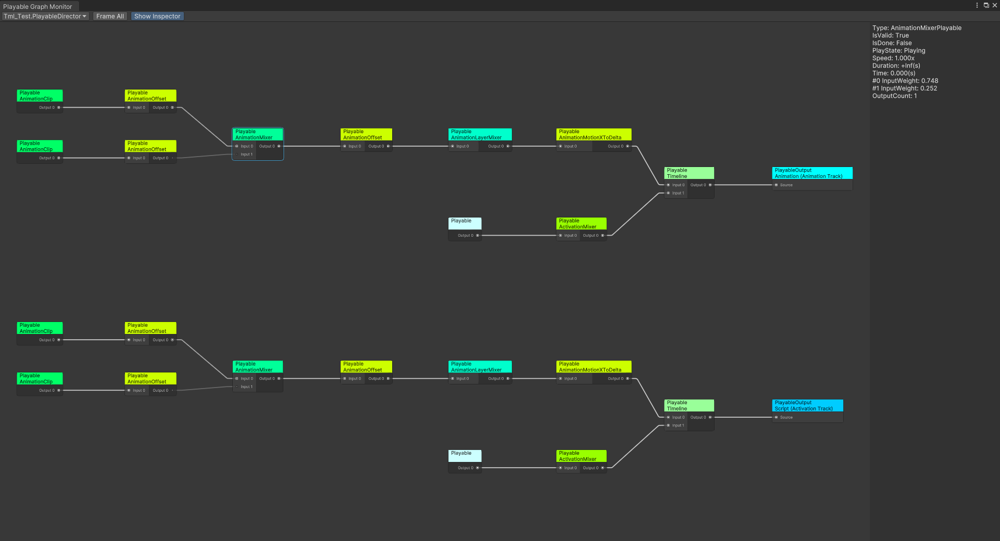

# Unity PlayableGraph Monitor Tool

PlayableGraph monitor tool inspired by [PlayableGraph Visualizer](https://github.com/Unity-Technologies/graph-visualizer) and implemented in UIElements.

[中文](./README_CN.md)

## Features

- Monitor all valid PlayableGraphs
- Inspect nodes in the PlayableGraph
- Draggable graph view
- Zoomable graph view

## Supported Unity Version

Unity 2019.4 and later.

## Installation

**In development.**

## How to use

Open PlayableGraph Monitor window from **menu** "Window/Analysis/PlayableGraph Monitor"，
then select a PlayableGraph from the **popup menu** on the top left of the window.
Select any node in the graph to inspect its details.
