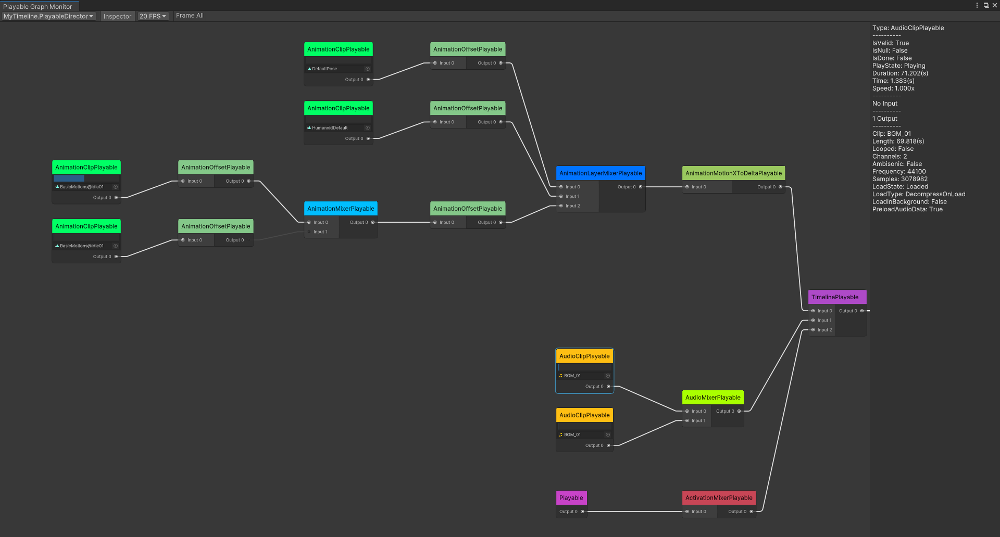

Unity PlayableGraph 监控工具
===

[English](./README.md)

用于在Unity Editor中实时监控PlayableGraph的工具。

# 功能

- 显示选定的PlayableGraph的拓扑结构（支持[大型PlayableGraph](#提升大型playablegraph的显示性能)）
- 使用鼠标左键选中节点显示其详细数据
- 使用鼠标中键拖拽视图
- 使用鼠标滚轮缩放视图
- 显示AnimationClip、AudioClip节点所使用的资产和播放进度
- 显示AnimationScriptPlayable节点的动画Job类型
- 可[为Playable节点添加额外文本标签](#为playable节点添加额外标签)
- 可设置视图最大刷新率
- 可[手动拖动节点调整布局](#手动拖动节点调整布局)
- 可显示[带有循环引用的PlayableGraph](#带有循环引用的playablegraph)（需要手动调整节点布局）

[屏幕截图](Documents~/Screenshots.md)

# 支持的Unity版本

Unity 2019.4或更新版本。

# 安装

 

从 [OpenUPM](https://openupm.com/packages/com.greenbamboogames.playablegraphmonitor/) 免费安装

或者

在 [Unity Asset Store](https://assetstore.unity.com/packages/tools/utilities/playablegraph-monitor-238251) 购买此包来支持此项目。

# 如何使用

从Unity Editor菜单项 **Window/Analysis/PlayableGraph Monitor** 打开PlayableGraph监控窗口。
在窗口左上角的弹出选框中选择一个PlayableGraph，即可查看此PlayableGraph的拓扑结构。
使用鼠标左键选中PlayableGraph中的任意节点，可在窗口内嵌的Inspector面板中查看节点详细数据。

## 为Playable节点添加额外标签

使用 `PlayableGraphMonitorWindow.Open(IReadOnlyDictionary<PlayableHandle, string>)` 或 `PlayableGraphMonitorWindow.TrySetNodeExtraLabelTable(IReadOnlyDictionary<PlayableHandle, string>)` 方法向Playable节点添加额外文本标签。

## 手动拖动节点调整布局

在监控工具窗口的工具栏中禁用 **Auto Layout **选项后，即可手动拖动节点调整布局。

## 带有循环引用的PlayableGraph

当PlayableGraph中节点含有循环引用时，监控工具无法自动计算节点布局。使用时如果发现监控工具未能正常排布节点，请查看控制台日志是否提示PlayableGraph中含有循环引用。在此情况下，可以用 **Auto Layout** 选项，然后手动拖动节点来找出PlayableGraph中的循环引用。

**需要注意**，如果PlayableGraph中有这样一组Playable，其中的每个Playable都是此组中另一个或多个Playable的输入（即没有根Playable），并且其中没有任何Playable连接到PlayableOutput，那么这组Playable将无法在监控工具中显示出来，也可能不会有任何错误提示。

## 提升大型PlayableGraph的显示性能

以下方式可以显著提升显示大型PlayableGraph时的性能：

- 禁用工具栏中的 **Inspector** 选项（或者不要选中任何节点）
- 禁用工具栏中的 **Clip Progress** 选项
- 降低最大刷新率
- 在监控工具窗口右上角的上下文菜单中禁用 **Keep updating edges when mouse leave GraphView** 选项（禁用后，鼠标离开拓扑图区域后，节点连接线的颜色不会再根据权重进行变化）
